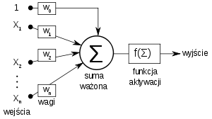

# Wstęp

  Na przestrzeni ostatnich kilkunastu lat sposób zdobywania informacji diametralnie się zmienił. Jeszcze niedawno, aby dowiedzieć się czegoś na temat aktualnych wydarzeń na świecie, człowiek musiał włączyć telewizor bądź radio. Natomiast gdy chciał zgłębić je jeszcze bardziej, zmuszony był do sięgnięcia po prasę. Poza tym informacje, które ludzie otrzymywali były wybierane przez osoby zarządzajace danym źródłem, co bardzo ograniczało odbiorcę. Miało to miejsce, ponieważ tematyka niekoniecznie mogła mu odpowiadać. Wiedzę naukową zdobywało się w szkołach, na uczelniach lub po prostu z odpowiedniej literatury. Jednak wraz z powstaniem internetu i jego bardzo intensywnym rozwojem, poprzednie wzorce straciły swą popularność na rzecz olbrzymiej masy informacji, którą można w nim znaleźć.

  W dzisiejszych czasach, gdy człowiek pragnie dowiedzieć się czegoś na nurtujący go temat wystarczy, że wpisze go do wyszukiwarki internetowej. Od razu po tym otrzyma listę dokumentów, artykułów, prac naukowych, bądz po prostu luźnych dywagacji użytkowników na forach internetowcyh. Dzięki temu użytkowicy sami mogą decydować, jaka informacja ich interesuje i kto jej dostarczy. Często też nowe wiadomości ze świata są przekazywane w reklamach, przez innych użytkowników lub po prostu znajomych, którzy chcą się podzielić tym, co ich interesuje. Jednak najbardziej znacząca zaleta internetu, mianowicie jego dostępność zarówno dla odbiorców i twórców, stała się jego największym problemem. Natomiast ilość nierzetelnych informacji, nieopierających się na żadnych badanich ani faktach, ogarnęła świat. Jednocześnie wprowadzając w błąd ludzi niebędących w stanie zweryfikować wiarygodności danego źródła. 

### Fake News

> **Fake news'em** nazywamy każdy fałszywy artykuł lub informację rozpowszechnianą w mediach, bez względu na intencję jej powstania.
  
  Brak intencjonalność jest bardzo istotny w tej defincji, ponieważ fałszywą informację może tworzyć i rozpowszechniać każdy. Może dokonać tego w pełni świadomy człowiek, bądź instytucja ze ściśle wytyczonym celem. Jednak może być to również nic nie podejrzewający czytelnik, chcący podzielić się świeżo zdobytą przez siebie wiedzą, która wydaję mu się prawdziwa. W związku z tym należy się zastanowić, dlaczego ludzie świadomie preparują informacje. Najpopularniejszym powodem jest chęć uzyskania pewnych wymiernych korzyści np.: 
 
 - zwiększenie popularności portalu internetowego skutkujące wzrostem dochodów,
 - odwrócenie uwagi od niewygodnych faktów.
  
  Jednak oczywiście nie jest to jedyny powód, gdyż fake news'y powstają również przez:
 
 - złośliwość (np. oczernienie człowieka),
 - chęć tworzenia zamentu dla rozrywki,
 - chęć manipulowania opinią.
 
  Szczególnie ten ostatni podpunkt spowodował bardzo duże zainteresowanie tematem fake news'ów w ostatnich latach. Podczas wyborów prezydenckich w Stanach Zjednoczonych w 2016 roku w internecie pojawiła się znaczna ilość nieprawdziwych artykułów na temat głównych kandydatów. Artykuły te były proponowane ludziom o takich poglądach potlitycznych, żeby zmaksymalizować prawdopodobieństwo przyjęcia tych informacji za stan faktyczny. Skala tych działań była duża do tego stopnia, że uważa się, że mogły one zadecydować o finalnym wyniku wyborów najpotężniejszego kraju na świecie. 
  
  Znaczny wpływ na tworzenie i rozpowszechnianie fałszywych informacji ma również ludzka ignorancja. Brak oczytania w danym temacie, naiwność, a także chęć wiary w zgodne z własnymi poglądami pogłoski, często powodują brak akceptacji merytorycznych argumentów i odrzucanie faktów. Takie wewnętrzne wyparcie prawdy może skutować powstaniem całkowicie nieracjonalnych nurtów i teorii spiskowych, takich jak np.: ruch antyszczepionkowy, czy wiara w "płaską Ziemię". Niefortunne w tym przypadku jest również to, że osoby rozpowszechniające takie wiadomości robią to z większą częstotliwością niż wiarygodne źródła. Skutkuje to tym, że ilość fałszywych informacji w danym temacie może być znacznie wieksza niż tych prawdziwych. W takim zbiorze danych łatwiej jest natrafić na mylące artykuły, co powoduje potencjalnie większą liczbę ich odbiorców.

### Wykrywanie i łagodznie

  Wraz z nasilającymi się wpływami fałszywych informacji na sytuację na świecie, powstała potrzeba ich wykrywania i łagodzenia negatywnych skutków, jakie wywołują. Istnieją różne podejścia do filtrowania fake new'sów. Jednym z podstawowych sposobów są metody manualne, to znaczy oparte na weryfikacji ludzkiej. Powstały strony internetowe takie jak *www.politifact.com*, które oferują sprawdzanie wiarygodności artykułów. Dzięki pracy profesjonalistów otrzymana informacja zwrotna jest wysoce konstruktywna. Jednak człowiek nie jest tak wydajny jak komputer i często na wynik takiej weryfikacji trzeba czekać stosunkowo długo. Tu z pomocną dłonią przychodzą prężnie rozwijające się nauki informatyczne, którę potrafią zautomatyzować i znacznie przyspieszyć weryfikację wiarygodności dokumentów, tym samym oferując wysokie prawdopodobieństwo poprawnego werdyktu. 
  Jednym z automatycznych podejść jest algorytm PageRank, bazujący na analizie źródła, z jakiego pochodzą wiadomości. Algorytm wykorzystuje powiązania między stronami internetowymi, dzięki którym można zbadać ich jakość (np. Informacje podane na stronach zaufanych, takich jak rządowe i uniwersyteckie, będą uważane za prawdziwe. Strony, którę są często linkowane przez zaufane portale, również będą ocenione jako źródło wysokiej jakości). Do automatyzacji doskonale nadają się również metody oparte na analizie treści dokumentów. Można obliczyć podobieństwo między jednym artykułem, a innym wcześniej już zweryfikowanym i na podstawie tego dokonać oceny wiarygodności.

# Cel pracy

  Celem pracy jest zaprojektowanie i wykonanie mikroserwisu internetowego, będącego w stanie weryfikować wiarygodność wysłanych przez użytkownika artykułów informacyjnych zarówno w formie tekstu jak i adresu portalu, na którym się znajdują. Usługa będzie w stanie opdowiedzieć, czy weryfikowany dokument posiada informacje wiarygodne, czy też nie. Wykorzystana do tego zostanie maszynowy model uczący, wyszkolony z użyciem odpowiedniego zbioru danych.

  ** *TODO: Opis rozdziałów po ich napisaniu* ** 

# Wprowadzenie teorytyczne oraz zagadnienia
  
  **Analiza lingwistyczna** jest jednym z podejść, które cechuje się dużą skutecznością przy wykrywaniu fake news'ów. Dzięki niej można wychwycić styl, w jakim dany dokument został napisany, wagę konkretnych słów oraz całych stwierdzeń w nim użytych, lub inne informacje charakteryzujące go na podstawie języka, w jakim został stworzony. Analiza lingwistyczna nie skupia się na tym, jaka wiadomość zostaje przekazywana do odbiorcy, lecz w jaki sposób jest do niego kierowana. Okazuje się, że jest to bardzo istotna wiedza, gdyż znaczna część fałszywych artykułów powstaje w całkiem podobnym stylu. Charakteryzują się one mocnym nacechowaniem emocjonalnym, starającym się spowodować, aby temat wywołał u odbiorcy efekt zaangażowania, przez co będzie on bardziej podatny na uznanie artykułu za prawdziwy. Krzykliwy styl, odciągający czytelnika od braku argumentów merytorycznych, jest łatwy do wykrycia. Wynika to z tego, że częstotliwość silnie nacechowanych przymiotników występująch w takim tekście będzie dużo większa niż w dokumencie zachowującym merytoryczność. Kolejnym aspektem, który sprawia, że analiza ta jest bardzo użyteczna, jest fakt, że dane powstałe przy jej stosowaniu są idealne do wykorzystania podczas nauczania maszynowego. Z kolei to pozwala na automatyzację procedury wykrywania fake news'ów. 

### Uczanie maszynowe

> **Uczanie maszynowe** jest to dziedzina zawierającą się w tematyce sztucznej inteligencji. Polega ona na badaniu algorytmów i modeli statystycznych, które są używane przez systemy komputerowe do wykonywania specyficznych, ściśle wytyczonych zadań, bez otrzymywania konkretnych instukcji. Zamiast tego polega się na dopasowaniu modelu do wzorca, czyli odpowiednio przygotowanych danych. Dzięki procesowi uczenia model ten jest w stanie wnioskować oczekiwane zachowanie dla innych, wcześniej nie procesowanych danych. Algorytmy uczące można podzielić na kilka podstawowych grup:

 - Ucznie nadzorowane - algorytmy te budują model matematyczny zestawu danych na podstawie próbek wejściowych i oczekiwanego dla nich wyniku. Dane testowe posiadają jedno lub więcej wejść w postaci wektora, nazywanego wektorem cech oraz odpowiadającego im wyjścia. Z ich użyciem model dostosowuję się do relacji, którą reprezentują. Algorytmy te wykorzystywane są przy problemach klasyfikacyjnych czyli w przypadku gdy wyjście skąłda się ze skończonego zbioru wartości lub regresyjnych, gdzie wyjście ma numeryczną wartość z jakegoś przedziału.
   
 - Ucznie nienadzorowane - w tym modelu nauczania dane testowe nie posiadają oczekiwanego wyjścia, składają się tylko i wyłącznie z wejść. Algorytmy tego rodzaju same znajdują regularności i podobieństwa pomiędzy porcjami danych, łącząc je w grupy lub klastry. Nie otrzymują danych skategoryzowanych, przez co polegają na obecności bądź braku wspólnych cech w danych. Centralnym zastosowaniem uczenia nienadzorowanego jest szacowanie gęstości w statystyce, na przykład poprzez znalezienie funkcji gęstości prawdopodobieństwa.

 - Uczenie częściowo nadzorowane - te algorytmy łączą w sobie cechy uczenia nadzorowanego i nienadzorowanego. Dane uczącę mogą, ale nie muszą posiadać etykiety czyli oczekiwanej wartości wyjściowej. Podejście, w którym model otrzymuje dane nieskategoryzowane i małą ilośc danych z etykietami, może wpłynąc na znacznie lepsze wyniki procesu uczenia.
   
### Sieci neuronowe

> **Sztuczna sieć neuronowa** to składająca się z elementów przetwarzających struktura matematyczna inspirowana biologiczną siecią neuronową występującą w mózgu. Model ten jest w stanie przetwarzać sygnały lub prowadzić obliczenia. Sztuczne sieci neuronowe są w stanie "uczyć się" wykonywania zadań poprzez analizę dawanych im podczas procedury nauczania przykładów (np.: rozpoznawanie twarzy na zdjęciach).

  Model ten bardzo dobrze nadaję się do weryfikowania fałszywych artykułów. Jego zadaniem byłoby wówczas znalezienie zależności wpływających na to, że dany dokument posiada nieprawdziwe wiadomości. Do tego potrzebny jest odpowiedni zbiór danych, zapewniający wystarczającą ilość próbek szkoleniowych. Dane te powinny być przygotowane tak, aby jak najbardziej ułatwić sieci znalezienie szukanych relacji (ze względu na "naturę" sieci neuronowych najlepiej przedstawiać dane w formie sygnału).

### Perceptron

> **Perceptronem** nazywamy najprostszą sieć neuronową, która jest algorytmem dla nauczania nadzorowanego z rodzaju klasyfikatorów binarnych. Oznacza to, że potrafi on ocenić, czy wejście w postaci wektora należy do jakiejś specyficznej klasy, czy też nie (np.: odróżnienie liczb parzystych od nieparzystych).

> **Neuron McCullocha-Pittsa** (Rysunek 1.1) to jeden z matematycznych modeli sztucznego neuronu. Posiada on jedno wyjście,  natomiast wiele wejść. Do każdego wejścia jest przypisana jego waga, czyli liczba rzeczywista. Na wyjściu podawana jest wartość funkcji aktywacji dla sumy ważonej wejść.

[//]: # (https://pl.wikipedia.org/wiki/Neuron_McCullocha-Pittsa)

**Rysunek 1.1** - Neuron McCullocha-Pittsa
 
> **Funkcja aktywacji** to fukcja definiująca wyjście w sieci neuronowej, może to być np. sigmoida (Rysunek 1.2).

[//]: # (https://cs231n.github.io/assets/nn1/sigmoid.jpeg)

**Rysunek 1.2** - Sigmoida

# Wykorzystane klasyfikatory

> **Problem klasyfikacyjny** to problem, który polega na skategoryzowaniu danych na jedną ze skończonej liczby klas.

> **Klasyfikator** to model umożliwaijący rozwiązywanie problemów klasyfikacyjnych. W kontekście wykrywania fake news'ów bedzie nas interesował tylko podzbiór klasyfikatorów binarnych, czyli takich, które klasyfikują dane na dwie kategorie np. fałszywe lub prawdziwe. 

> **Liniowo separowalny problem klasyfikacyjny** to problem, w którym dane da się podzielić na dwie klasy poprzez postawienie linii prostej pomiędzy danymi odpowiednio przedstawionymi w przestrzeni. Dane z natury mogą być liniowo separowalne np. alternatywa lub koniunkcja jednak w niektórych przypadkach trzeba je wcześniej odpowiednio przekształcić lub zmapować na większą liczbę wymiarów, aby uzyskać liniową separowalność.

[//]: # (https://i1.wp.com/www.tarekatwan.com/wp-content/uploads/2017/12/linear_sep.png?w=1516)

**Rysunek 2.1** - A) Problem liniowo separowalny B) Problem liniowo nie separowalny

### Maszyna wektorów nośnych

> **Maszyna wektorów nośnych** (*SVM, ang. Support Vector Machine*) to model używany do rozwiązywania problemów klasyfikacyjnych lub regresyjnych, wykorzystujący nadzorowany sposób uczenia się, czyli dane uczące muszę być wcześniej odpowiednio przygotowane w taki sposób, aby każda porcja treningowa posiadała wejście i wyjście. Model SVM reprezentuje przykłady jako punkty w przestrzeni, zmapowane w taki sposób, aby przykłady oddzielnych kategorii były oddzielone przez jak najszerszą wyraźną lukę. Każdy przykład z zestawu danych szkoleniowych jest oznaczony jako należący do jednej z dwóch kategorii. SVM tworzy model, który mapuje nowe przykłady na tę samą przestrzeń. Na podstawie pozycji punktu w przestrzeni przewiduje, do której kategorii dane należą. Oprócz przeprowadzania klasyfikacji liniowej, maszyny wektorów nośnych mogą skutecznie przeprowadzać klasyfikację nieliniową. Do uzyskania takich rezultatów wykorzysuję się różne jądra, które umożliwiają mapowanie danych wejściowych na wielowymiarowe przestrzenie cech.

### Drzewa decyzynje

> **Drzewa decyzyjne** (*ang. Decision trees*) to drzewiasy graf wspomagający podejmowanie decyzji poprzeż użycie odpowiednich warunków. W nauczaniu maszunowym są wykorzystywane do predykcji oraz klasyfikacji. W drzewach klasyfikujących ilość liści (ostatnich wierzchołków grafu) odpowiada ilość kategorii lub klas, do których klasyfikuje się dane, a gałęzie (ścieżki prowadzące do liścia) reprezentują połączenia cech, które charakretryzują konkretną klase.

[//]: # (https://en.wikipedia.org/wiki/Decision_tree_learning)

**Rysunek 2.2** - Drzewo pokazujące szanse na przeżycie katastrofy Titanic'a (*"sibsp" liczba małżonków lub rodzeństwa na pokładzie*)

### Losowe lasy decyzyjne

> **Losowe lasy decyzyjne** (*ang. Random Forests*) to model, który podczas szkolenia i klasyfikacji wykorzystuje wiele drzew decyzyjnych. Finalna klasyfikacja jest wyznaczana z uwzględnieniem wyników cząstkowych poszczególnych drzew np: najczęściej powtarzająca się klasa. Pojedyncze drzewo jest tworzone przez wylosowanie ze zwracaniem pewnej liczby wejść ze zbioru treningowego. Na wierzchołku jest dokonywany podział jedynie na podstawie losowo wybranych cech, których liczba musi byc znacznie mniejsza niż suma wszystkich cech wystepujących w danych. Ta własność powoduje, że losowe lasy decyzyjne dobrze sprawdzają się w problemach o dużej wymiarowości.

### Naiwny klasyfikator bayesowski

> **Naiwny klasyfikator bayesowski** (*ang. Naive Bayes classifier*) to model, w którym kluczową role odgrywa założenie, że wartości poszczególnych cech są od siebie niezależne (dlatego jest nazywany naiwnym). Jest szkolony metodami nadzorowanego uczenia się i cechuję się dobrą wydajnością, szczególnie gdy dane treningowe posiadają duża ilość cech. Dodatkowo naiwne klasyfikatory Bayesowskie potrzebują niewielkiej ilości danych szkoleniowych do oszacowania parametrów niezbędnych do klasyfikacji.

# Podobne rozwiązania

  Istnieje wiele rozwiązań wykrywania fake news'ów bazujących na analizie lingiwstycznej oraz nauczaniu maszynowym. Jednak, szczególnie w kontekście założeń pracy, warto przytoczyć wykonane przez Aarona Edella API (*z ang. Application Programming Interface*), korzystające w wyszkolonej sieci neuronowej. Pozwala ono na wysyłanie zapytań o weryfikację artykułu. Projekt nazywa się "Fakebox" i oferuje skuteczność na poziomie 95%. Jest to bardzo wysoki wynik uzyskany dzięki połączeniu kilku metod. Aaron postanowił badać nie tylko treść artykułów, ale również ich tytuł oraz URL (*z ang. Uniform Resource Locator*), czyli źródło. Unikatowe w podejściu twórcy jest także to, że nie skupia się on, de facto, na detekcji fałszywych informacji, ale na znajdowaniu tych prawdziwych. Dopiero dopełnienie ich zbioru jest uznawane za nieprawdziwe. Okazało się, że dzięki takiemu rozwiązaniu wykrywalność wrosła z 70% do wcześniej wspomnianych 95%. 

  Innym, wartym przywołania, automatycznym rozwiązaniem bazującym na analizie lingwistycznej jest projekt stworzony przez Jacopo Notarstefano o nazwie "Stop the bullshit". Francuski programista postanowił zmieniać formę weryfikowanych dokumentów tak, aby zostawiać w nich jak największą ilość znaczących informacji. Są z nich usuwane cyfry, znaki interpunkcyjne oraz słowa nic nie znaczące, takie jak np. spójniki. Po tej operacji dokument jest traktowany jako zbiór słów. Dzięki temu można zbadać podobieństwo między artykułami obliczając odległość Jaccarda, która jest stosunkiem części wspólnej do sumy zbiorów. Podobne dokumenty są grupowane, a konkretne grupy w większości reprezentują ten sam rodzaj informacji (np. fałszywe). Wraz z rozszerzaniem bazy dokumentów, weryfikacja jest bardziej trafna, gdyż zwiększa się różnorodność grup. Wadą tego rozwiązania jest potrzeba dużego zbioru początkowego tak, aby łatwo było przydzielić konkretną frakcję dla badanego artykułu oraz dużą ilość porównań przy każdej weryfikacji.